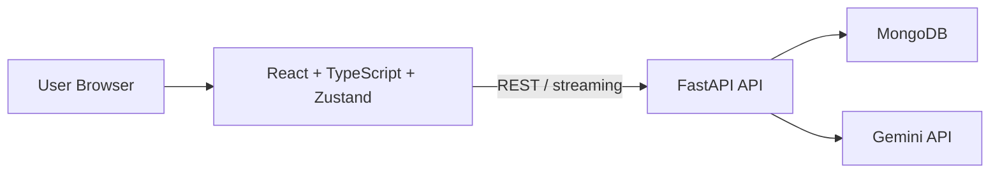

# NovaScribe

NovaScribe is a full-stack AI chat workspace built for the kind of role that expects modern frontend engineering, scalable FastAPI services, LLM integration, authentication, persistence, and production-minded architecture.

It now includes:

- React + TypeScript frontend
- Zustand state management
- FastAPI backend
- MongoDB for users, sessions, and chat history
- Session-token authentication
- Gemini multi-key fallback
- Searchable chat history
- Docker setup for frontend, backend, and MongoDB

## Architecture



## Tech Stack

### Frontend

- React
- TypeScript
- Zustand
- Tailwind CSS
- Vite

### Backend

- Python
- FastAPI
- Pydantic
- MongoDB (`pymongo`)

### AI

- Google Gemini API
- Structured prompting
- Streaming responses
- API-key fallback rotation

### DevOps

- Docker
- Docker Compose
- Nginx container for frontend serving and API proxying

## Project Structure

```text
AI ChatBot/
|- backend/
|  |- app/
|  |  `- main.py
|  |- Dockerfile
|  |- requirements.txt
|  `- .env.example
|- frontend/
|  |- src/
|  |  |- App.tsx
|  |  |- api.ts
|  |  |- store.ts
|  |  |- types.ts
|  |  `- index.css
|  |- Dockerfile
|  |- nginx.conf
|  `- package.json
|- docker-compose.yml
`- README.md
```

## Authentication Flow

1. New users sign up with name, email, and password.
2. Passwords are hashed before storage.
3. The backend creates a session token after signup/login.
4. The frontend stores the session token in Zustand persisted state.
5. Protected chat endpoints require `X-Session-Token` or `Authorization: Bearer <token>`.

## Database Schema

### `users`

- `name`
- `email`
- `password_hash`
- `created_at`

Indexes:

- unique index on `email`

### `sessions`

- `user_id`
- `token`
- `created_at`

Indexes:

- unique index on `token`
- index on `user_id`
- index on `created_at`

### `chats`

- `owner_id`
- `title`
- `model`
- `messages`
- `created_at`
- `updated_at`

Indexes:

- index on `owner_id`
- index on `updated_at`
- compound index on `owner_id + updated_at`
- text index on `title` and `messages.content`

## Environment Variables

Create `backend/.env` from `backend/.env.example`.

```env
GEMINI_API_KEY=your_single_key_here
GEMINI_API_KEYS=key_one,key_two,key_three
GEMINI_MODEL=gemini-2.5-flash
FRONTEND_ORIGIN=http://localhost:5173
MONGODB_URI=mongodb://localhost:27017
MONGODB_DB_NAME=nova_scribe
```

Notes:

- Use `GEMINI_API_KEYS` for multiple-key fallback.
- If both are present, the backend prefers `GEMINI_API_KEYS`.
- For multiple-key fallback to be useful, use keys from different Google projects when possible.

## Local Development

### 1. Start MongoDB

If MongoDB is installed as a Windows service:

```powershell
net start MongoDB
```

### 2. Start the backend

```powershell
cd "C:\Users\BALA JI\OneDrive\Desktop\AI ChatBot\backend"
python -m pip install -r requirements.txt
python -m uvicorn app.main:app --host 127.0.0.1 --port 9000
```

### 3. Start the frontend

```powershell
cd "C:\Users\BALA JI\OneDrive\Desktop\AI ChatBot\frontend"
npm install
npm run dev
```

### 4. Open the app

- Frontend: [http://localhost:5173](http://localhost:5173)
- Backend health: [http://127.0.0.1:9000/api/health](http://127.0.0.1:9000/api/health)

## Docker Run

From the project root:

```powershell
docker compose up --build
```

Then open:

- Frontend: [http://localhost:8080](http://localhost:8080)
- Backend health: [http://localhost:9000/api/health](http://localhost:9000/api/health)

## API Overview

### Auth

- `POST /api/auth/signup`
- `POST /api/auth/login`
- `GET /api/auth/me`
- `POST /api/auth/logout`

### Chats

- `GET /api/chats`
- `POST /api/chats`
- `GET /api/chats/{chat_id}`
- `POST /api/chats/{chat_id}/messages/stream`

### System

- `GET /api/health`
- `POST /api/chat/stream`

## Interview Talking Points

This project is now suitable to explain in interviews for a full-stack AI role:

- Built a React + TypeScript frontend with Zustand for app-wide state.
- Designed a FastAPI backend for auth, chat persistence, and AI streaming.
- Added MongoDB persistence with indexes for search and retrieval.
- Implemented session-token authentication instead of a temporary user-id header approach.
- Integrated Gemini with multi-key fallback and graceful failure handling.
- Added Dockerized local deployment for frontend, backend, and database.

## Recommended Next Improvements

- Add refresh-token flow or session expiry cleanup
- Add unit/integration tests
- Add route protection and role-based access
- Add message pagination for large chat histories
- Add cloud deployment on AWS or GCP
